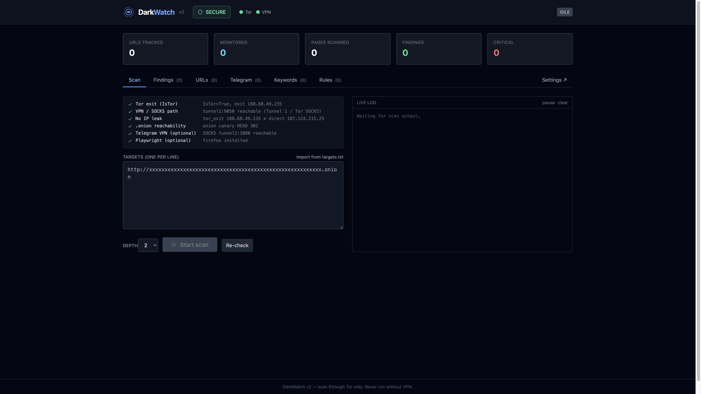
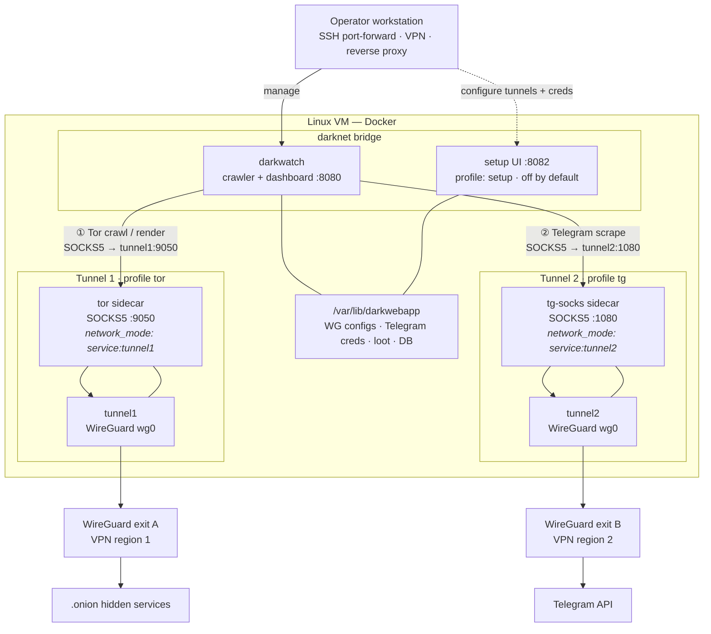

<p align="center">
  
</p>

<h1 align="center">DarkWatch</h1>

<p align="center">
  <em>Self-hosted dark-web threat intelligence: crawl Tor hidden services and Telegram channels, classify with YARA, browse via web dashboard. Designed OPSEC-first.</em>
</p>

<p align="center">
  <a href="LICENSE"></a>
  
  
  
  
</p>

---

**Status:** Public release — **v0.1.0**

<p align="center">
  
</p>

---

## Table of contents

- [What this is](#what-this-is)
- [What this is not](#what-this-is-not)
- [Architecture](#architecture)
- [Quick install](#quick-install)
- [The Setup UI (configure via browser)](#the-setup-ui-configure-via-browser)
- [Day-to-day operations](#day-to-day-operations)
- [Repository layout](#repository-layout)
- [What AGPL means for you](#what-agpl-means-for-you)
- [AI usage policy](#ai-usage-policy)
- [Security disclosures](#security-disclosures)
- [Acknowledgments](#acknowledgments)

---

## What this is

DarkWatch is deployed via docker compose:

- **`darkwatch`** — autonomous crawler for Tor `.onion` services and Telegram channels. Sanitizes and screenshots responses, classifies with YARA rules, persists findings to SQLite, exposes a Flask + React web dashboard for triage. Routes through two independent WireGuard tunnels so dark-web traffic and Telegram traffic never share an exit IP.

Runs via `docker compose` on a single Linux VM. Operator state — credentials, scraped content, databases — lives outside the git checkout (`/var/lib/darkwebapp/`) and never enters version control.

## What this is not

- **Not a tool for accessing illegal content.** The crawler exists to detect and triage threats. What you do with what it finds is on you, and your legal posture is your responsibility.
- **Not a turn-key SaaS.** You bring your own VM, your own VPN, your own YARA rules, and your own legal review.
- **Not safe to expose to the public internet.** The dashboards have no built-in auth — reach them via SSH port-forward, your own VPN, or a reverse proxy with auth that *you* configure. The `DARKWATCH_BIND_IP` env var controls the bind interface; it defaults to `127.0.0.1`.

## Architecture

Two independent WireGuard tunnels (e.g. ProtonVPN in two regions, or any provider that hands you raw `wg0.conf` files) provide **egress isolation**:

| Path | Compose profile | WireGuard container | Sidecar (shared netns) | Workload egress |
| ---- | --------------- | ------------------- | ---------------------- | --------------- |
| **Tunnel 1** | `tor` | `tunnel1` | `tor` → SOCKS `:9050` | `.onion` crawl + render |
| **Tunnel 2** | `tg` | `tunnel2` | `tg-socks` → SOCKS `:1080` | Telegram MTProto |

`darkwatch` stays on the internal `darknet` bridge and reaches each SOCKS proxy by container hostname. It never uses host networking. Tor and `tg-socks` inherit their tunnel container's network namespace, so **all** traffic on that path exits through that tunnel's WireGuard peer only — the two research paths never share an exit IP.




| Profile     | Services              | Purpose                                       |
| ----------- | --------------------- | --------------------------------------------- |
| *(default)* | `darkwatch`           | Dashboard + crawler core                      |
| `tor`       | `tunnel1`, `tor`      | `.onion` crawl egress                         |
| `tg`        | `tunnel2`, `tg-socks` | Telegram scrape egress                        |
| `setup`     | `setup`               | Browser config UI (bring up only when needed) |


`deploy.sh` auto-enables `tor` / `tg` when the matching WireGuard config exists under `/var/lib/darkwebapp/secrets/`.

## Quick install

**Use one path:** clone the repo on the VM, then run the installer. Everything else (`bootstrap.sh`, `deploy.sh`, hardening) is called from there.

You need:

- A Linux VM (Ubuntu 24.04+ or Debian 12+ recommended), 4 GB RAM minimum, 50 GB disk, root SSH access.
- Docker 24+ (`docker compose version` should print 2.20+).
- Optional: WireGuard VPN configs for Tor and/or Telegram egress (can be added later via the Setup UI).
- Optional: SSH port-forwarding or your own VPN to reach the dashboards from your laptop.
- Optional: Telegram `api_id` / `api_hash` from [https://my.telegram.org/apps](https://my.telegram.org/apps) for the Telegram scraper.

```bash
sudo mkdir -p /opt && cd /opt
sudo git clone https://github.com/omarinfosec/darkwatch.git darkwebapp
cd /opt/darkwebapp
sudo ./ops/install.sh
```

The installer runs: prereq check → state directory → env file → optional hardening → first deploy → prints dashboard URLs and the Setup UI token.

Nothing in that flow blocks on Telegram credentials or WireGuard tunnels — add them later via the Setup UI, then re-run `sudo ./ops/deploy.sh`.

Non-interactive re-run:

```bash
sudo ./ops/install.sh --yes --skip-hardening
```

After install, day-to-day updates are always:

```bash
cd /opt/darkwebapp && sudo ./ops/deploy.sh
```

### What the installer prints at the end

```
DarkWatch:       http://<bind-ip>:8080/

Bring up the Setup UI to configure tunnels + Telegram from your browser:
    docker compose --profile setup up -d setup
    open http://<bind-ip>:8082/?token=<SETUP_AUTH_TOKEN>
    docker compose --profile setup stop setup
```

### Selectively enabling tunnels

The two WireGuard tunnels are gated behind compose profiles — you decide which ones to run:


| Profile | What it starts                 | When to enable                                  |
| ------- | ------------------------------ | ----------------------------------------------- |
| `tor`   | `tunnel1` + `tor` sidecar      | You want to crawl `.onion` services             |
| `tg`    | `tunnel2` + `tg-socks` sidecar | You want to scrape Telegram                     |
| `setup` | the browser-based config UI    | When you need to (re)configure tunnels or creds |


`ops/deploy.sh` **auto-detects** which tunnels are configured (by checking whether `wg_confs/wg0.conf` exists under `/var/lib/darkwebapp/secrets/tunnelN/`) and enables the matching profile. So the practical workflow is: install with no tunnels → use the Setup UI to drop in your first WG config → re-run `deploy.sh` → that tunnel comes up. Same for the second tunnel later if you want it.

If neither tunnel is configured, `darkwatch` still starts — it just can't crawl `.onion` or scrape Telegram until you add configs via the Setup UI and re-run `deploy.sh`.

## The Setup UI (configure via browser)

A profile-gated, bearer-token-protected web UI for placing your Telegram credentials and WireGuard tunnel configs without editing files on the VM. It's off by default (the privileges to write secrets and restart containers should not always be available), and lives at port 8082.

```bash
# Enable
sudo docker compose --profile setup up -d setup

# Use (token is in /var/lib/darkwebapp/env as SETUP_AUTH_TOKEN)
open http://$DARKWATCH_BIND_IP:8082/?token=<SETUP_AUTH_TOKEN>

# Disable when done
sudo docker compose --profile setup stop setup
```

The UI has three sections — **Telegram credentials**, **Tunnel 1 (Tor research path)**, **Tunnel 2 (Telegram research path)** — pre-populated with whatever's already configured. Each Save validates inputs and restarts the affected services. There's also a **Settings ↗** link in the main DarkWatch dashboard navigation that opens the Setup UI in a new tab.

## Day-to-day operations

```bash
ssh deploy@<vm>                            # not root — use the deploy user from harden-phase2
cd /opt/darkwebapp

sudo ./ops/deploy.sh                       # pull + build + up + healthcheck + egress verify
sudo ./ops/verify-egress.sh                # confirm Tor + TG isolation
docker compose ps                          # what's running
docker compose logs -f darkwatch           # tail one service
docker compose restart tunnel1             # restart a specific service
sudo ./ops/retention.sh                    # enforce loot/ retention windows (also runs nightly via cron)
```

Full operator runbook including incident playbooks, maintenance schedule, and environment cheat sheet: [ops/RUNBOOK.md](ops/RUNBOOK.md).

## Repository layout

```
darkwatch/            # crawler + Flask/React dashboard (port 8080)
setup/                # browser-based config UI (port 8082, profile-gated)
tor/                  # custom Tor sidecar (templates torrc from env)
tunnels/              # WireGuard config templates (real configs NEVER here)
  tunnel1/            #   Tor research path
  tunnel2/            #   Telegram research path
ops/                  # install.sh (first run), deploy.sh (updates), RUNBOOK.md
docker-compose.yml
.env.example          # env template; real values live on the VM only
```


## What AGPL means for you

DarkWatch is licensed under [AGPL-3.0](LICENSE). If you modify DarkWatch and run it as a network service, AGPL requires you to make your modified source available to users of that service. Forks and internal deployments should review the full license text.

## AI usage policy

DarkWatch has **no AI/LLM integration at runtime** — the app does not call OpenAI, Anthropic, or similar APIs.

[AI_POLICY.md](AI_POLICY.md) covers **how this repository is developed and contributed to**. It is adapted from [Ghostty](https://github.com/ghostty-org/ghostty/blob/main/AI_POLICY.md). I use **Claude** and **Cursor** when writing and maintaining the codebase; outside contributors must disclose AI-assisted production code in pull requests and verify it themselves.

## Acknowledgments

DarkWatch stands on free-software shoulders. The list is intentionally explicit — if you fork or extend this project, these credits travel with you under AGPL-3.0.

### Direct dependencies

#### Egress + isolation

- **[Tor Project](https://www.torproject.org/)** — anonymous communication network and software. The `tor` sidecar we build on is the upstream Tor daemon from the Debian package, with a custom torrc generated at container start. Without Tor, none of this works.
- **[WireGuard](https://www.wireguard.com/)** — modern, audited VPN protocol that makes two-tunnel egress isolation tractable to deploy. Container is built on [linuxserver/wireguard](https://hub.docker.com/r/linuxserver/wireguard). The two-tunnel design (separate Tor egress + separate Telegram egress) is the entire OPSEC backbone of this project.
- **[serjs/go-socks5-proxy](https://github.com/serjs/go-socks5-server)** — the small SOCKS5 proxy we drop alongside the Telegram WG container so darkwatch can reach Telegram via that tunnel.


#### Crawl + capture

- **[Playwright](https://playwright.dev/)** by Microsoft — headless Firefox for rendering and screenshotting `.onion` pages. The `tor_render` screenshot mode routes the browser through the Tor SOCKS port so render-time fetches stay isolated.
- **[Telethon](https://github.com/LonamiWebs/Telethon)** by Lonami — Telegram MTProto client. The Telegram scraper, alerting integration, and channel-discovery flows all build on this.
- **[BeautifulSoup](https://www.crummy.com/software/BeautifulSoup/)** + [lxml](https://lxml.de/) — HTML parsing for the crawler.
- **[Pillow](https://python-pillow.org/)** — screenshot post-processing (thumbnails, format conversion).

#### Web layer

- **[Flask](https://flask.palletsprojects.com/)** + [Werkzeug](https://werkzeug.palletsprojects.com/) — darkwatch's main web/API layer.
- **[Jinja2](https://jinja.palletsprojects.com/)** — server-side templates in the dashboards.
- **[React](https://react.dev/)** + [esbuild](https://esbuild.github.io/) + [Tailwind CSS](https://tailwindcss.com/) — darkwatch's React UI is bundled at build time so the runtime makes zero CDN calls.

#### Data + ops

- **[SQLite](https://www.sqlite.org/)** — local-first persistence. Three separate databases (darkwatch findings, recon pipeline, telegram session); no server to operate.
- **[Docker Compose](https://docs.docker.com/compose/)** — service orchestration on a single VM.
- **[stem](https://stem.torproject.org/)** — Tor controller library (used for NEWNYM circuit rotation between investigations).
- **[Prometheus client](https://github.com/prometheus/client_python)** — metrics export hooks (currently dormant; reserved for future scraping).

### Inspirations and influences

> *I always used telegram OSINT tools like Telethon, but wanted a GUI interface for it. "Thanks to AI", started updating the GUI added features like Onione site crawler, alerting , Yara rules detection. *

- The broader **CTI / OSINT community** for the OPSEC patterns this project tries to follow: separate egress paths per workload, never trust the network.

### Upstream licenses

DarkWatch itself is [AGPL-3.0](LICENSE). All listed dependencies retain their own licenses; consult the upstream projects for terms. The ones that matter most for redistribution:

- Tor — BSD 3-clause
- WireGuard tools — GPL-2.0
- YARA — BSD 3-clause
- Telethon — MIT
- Playwright — Apache-2.0
- Flask — BSD 3-clause
- SQLite — public domain

### Want to be listed here?

If something in this repo is derivative of work we should credit explicitly — open source, papers, blog posts, conference talks — open an issue and we'll add it. We'd rather over-credit than under-credit.
